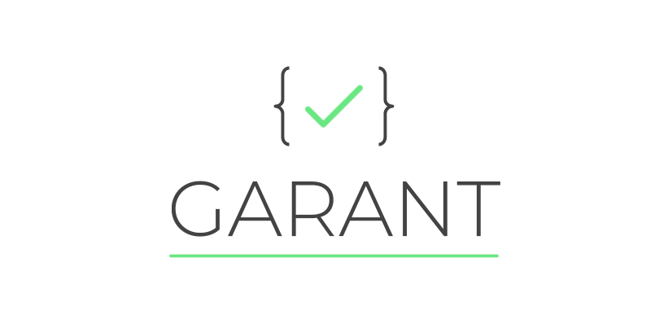

Simple and lightweight javascript object schema validation library.

## Installation

**Garant** can be installed using yarn or npm.

```shell
npm install garant
# or
yarn add garant
```

## Usage
```javascript
import {Validator} from 'garant';
// or
const {Validator} = require('garant');

const schema = {
    username: {
        type: 'string',
        required: true
    },
    email: {
        type: 'string',
    },
    info: {
        type: 'object',
        children:{
            age: {
                type: 'number',
            },
            height: {
              type: 'number',
          }
        }
    }   
};

const validator = new Validator(schema);

const object = {
    username: 'Jane',
    email: 'jane@example.com',
    info: {
        age: 22,
        height: 165
    }
};

const results = validator.check(object);

// {
//     hasError: false,
//     messages: [],
//     data: {
//       username: 'Jane',
//       email: 'jane@example.com',
//       info: {
//           age: 22,
//           height: 165
//       }
//     }
// }

```

## Road map

- ~~**Required** checker~~
- ~~**Type** checker~~
- ~~**Children** checker~~
- Improve documentation
- **Default** checker (set default value if undefined)
- **Regex** checker
- **Length** (min, max) checker
- **Array content** checker

Want to add your *checker*? Simply create yours in the [src/checkers](./src/checkers) directory and register it in the Validator class. Submit your pull request! 

## Contribute
**Pull requests are welcome !** Feel free to contribute.

## Credits
Coded with ❤️ by [Corentin Thomasset](//corentin-thomasset.fr).

## License
This project is under the [MIT license](./LICENSE.md).
